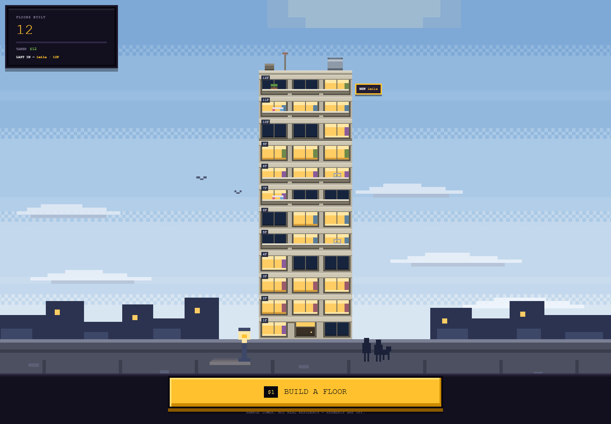
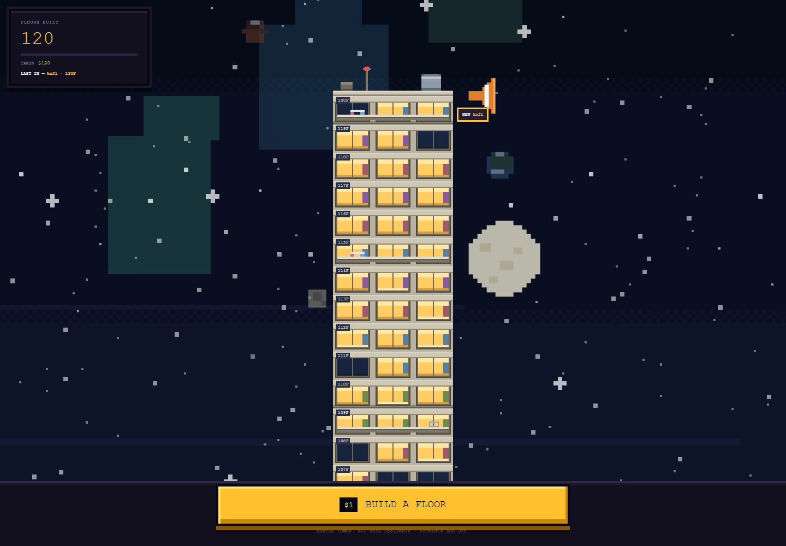

# The $1 Floor

**One dollar, one floor.** A public pixel-art apartment tower where every storey was bought for
exactly $1. Pay, and a floor is added on top of the stack — its windows light up, somebody moves in,
and the camera rises one storey. Nothing is ever removed.

The tower is the only chart on the page. Height *is* the readout, and the readout is a building full
of people.



## What it is

A Next.js page, a Postgres database and Stripe Checkout, wrapped around an engine that is still the
one hand-written `index.html` it began as. `index.html` is kept, frozen, because it is the baseline
every measurement here is taken against: `baseline/verify-port.mjs` proves `lib/engine.ts` is that
file's script line for line, and `baseline/domdiff.mjs` holds `components/frame.tsx` to its DOM node
for node. [`ARCHITECTURE.md`](ARCHITECTURE.md) explains why the tower is still imperative,
hand-written DOM inside a React page — and why that is not something to tidy.

Every pixel of the tower, the sky and the interface is drawn in the document: the facade is a real
elevation (header band, window row, sill, slab), the sky is a column of CSS-drawn bands, and each
floor's residents, curtains, balconies and window lights are derived deterministically from its
floor number alone.

- **One fixed price.** $1 per floor. No tiers, no bidding, no escalating minimum — the most anyone
  can beat you by is one dollar.
- **Permanence.** Floors never expire, are never rotated out, are never deleted.
- **Batch ordering.** Hold the button and one charge builds every floor in the order — buying ten
  floors is still one action and one payment, not ten.
- **Scrolling is the climb.** The rail is exactly as long as the tower stands above the frame, so the
  bottom of the rail is the street and the top is the newest floor under the roof.
- **Only the visible storeys are painted.** About four dozen floors around the camera live in the
  DOM at once; each floor's position in the world is fixed by its number alone, so a thousand-floor
  tower scrolls as smoothly as a ten-floor one.

## The climb

Buy a floor and the whole world falls with the camera: clouds, skyline, sidewalk, street and clip
line drop by exactly one storey on the same beat, so the tower reads as climbing rather than the base
sinking into the road. The sky runs six frames deep — haze over the roofs, the sun, sunset, night,
and out into space — with the stars and the moon fading in as you climb *out of* the light that hides
them.



At the far end, ten small worlds ride the frame's far layer alongside the moon. They are held at the
same twentieth of the climb she is, drawn *behind* her disc so she occludes any world that crosses
her, and faded to a fraction of her own opacity. They are smaller than her, dimmer than her, and
never brighter than a star.

## Run it

```sh
npm install
cp .env.example .env.local     # every variable in it is optional
npm run dev
# → http://127.0.0.1:3000/
```

With an empty `.env.local` the page is the demo it has always been: **nothing is charged**, and the
button builds floors in the browser. To take money you need a database and a Stripe key — both, not
either, because a card charged with nowhere to put the floor is worse than no card at all:

```sh
docker run -d --name tower-builder-pg \
  -e POSTGRES_PASSWORD=tower -e POSTGRES_USER=tower -e POSTGRES_DB=tower \
  -p 55432:5432 -v tower-builder-pgdata:/var/lib/postgresql/data postgres:16
npm run db:migrate
```

Useful query parameters:

| Param | Effect |
| --- | --- |
| `?n=120` | Seed the tower with that many floors, so you can see it tall without buying anything |
| `?paid=cs_…` | Where Stripe returns a buyer to; the page reconciles that payment itself |
| `?v=70` | Cache buster for capturing |

`index.html` can still be served on its own (`python -m http.server 8080`) and it still works — it
is the original, and the app is measured against it, not the other way round.

## The tooling

The `tools/` folder holds the measuring instruments used to build this — a Chrome DevTools Protocol
harness that drives the page, waits for it to settle, screenshots it, and then evaluates a probe
script inside it. They are why the art in this repo can be checked by number instead of by eye.

```sh
node tools/shoot.mjs --url 'http://127.0.0.1:3000/?n=120' --prefix shot --only desktop \
  --eval-file tools/probe-px2.js
```

| Tool | What it is for |
| --- | --- |
| `shoot.mjs` | The harness: launches Chrome, waits for a settled frame (stable geometry, no animations running), screenshots across viewports, evaluates a probe |
| `sky.mjs` | Pixel census of a frame — classifies colours, builds a luminance histogram, locates the brightest pixel. The instrument that actually measures depth |
| `px.mjs`, `map.mjs` | Structure maps: where the bands, blocks and storeys land |
| `crop.mjs`, `find.mjs` | Crop-and-enlarge and colour-locate, the substitutes for eyes |
| `probe-px2.js` | The standing geometry probe — eleven invariants covering the floor heights, the pan, the drop and the window |
| `probe-scroll.js`, `probe-sky.js`, `probe-camera.js`, `probe-sign.js`, `probe-batch.js` | Rail, sky, camera, signboard and batch-order probes |
| `space.js`, `midrail.js` | Far-layer sweep and mid-rail checks |
| The rest | One-off probes kept for their evidence |

### Two things the instruments learned the hard way

**Measure layout, never a raw rect.** A landing storey animates in with a `drop` keyframe that puts
it a full floor height above its slot, and `getBoundingClientRect()` includes that translate. Every
layout read has to go through the harness's own `layY()`.

**Never diff two screenshots.** The stars randomise per load, so two captures of the *same* URL
differ across the whole frame. Only ever measure within one frame.

## Status

Working end to end, and unbuilt: nobody has bought a floor yet, so the tower is empty. Payments are
wired to Stripe Checkout — cards only — and switched off unless the deployment supplies both a
database and a key; without them it is the demo, and the demo is a supported state rather than a
broken one. Moderation is decided and in the code: a name is judged where it is typed and again
where it is stored, and a floor that has to be taken down keeps its number and its height and loses
only its words. That exception is the single bend in the permanence promise, and it is written down
in [`ARCHITECTURE.md`](ARCHITECTURE.md) §6 rather than left to be discovered.

Also still open: who carries the tax on a $1 cross-border sale, and whether a buyer may later edit
or remove their own floor.

`ARCHITECTURE.md` is the short read for anyone about to change the code: the page's two halves, the
demo-mode switch, the one transaction that grows the tower, and the traps that look like something
else.

`OVERVIEW.md` is the long read: the pitch end to end, the business and the money, and how the app is
actually built — the five systems, the laws of the world, and where each one lives.

`PRODUCT.md` is the product truth — users, positioning, confirmed capabilities, and the things that
are deliberately still open. Read it before adding a feature; it is the document that says what this
is *not*. `archive/v1-bricks.html` is the abandoned first world, kept for reference.
